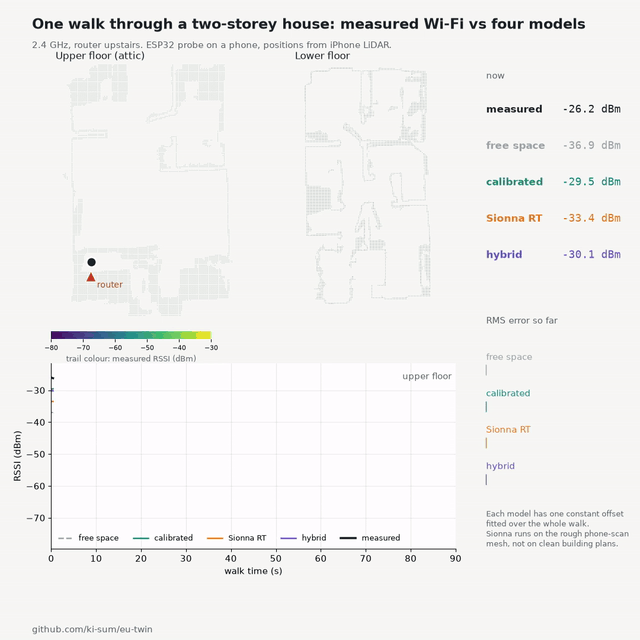

# EU Twin

AI can already look at images and video and make sense of 3D space. We think
the next layer is the electromagnetic twin of that space: where the radio
signal is strong, where it is weak, and why. Home robots will need it to know
where they stay connected, and people need it to decide where the router
should go.

This repository is a first step: walk through a home once with a phone,
record the Wi-Fi signal, and compare the measurements with simple and
physics-based predictions.



*One ten-minute walk over two floors at 12x speed: measured RSSI (black)
against four models. Router upstairs; each model gets one fitted offset;
Sionna RT runs on the rough phone-scan mesh. Made with
`scripts/walk_replay.py`.*

This is an early research project, not a finished app. What is here is the
measurement setup, the analysis code and the write-ups from the first real
tests, in early October 2026, in one house with a typical German
layout: an attic floor under a pitched roof, a concrete slab, and brick-walled
rooms below.

## What we found so far

All numbers come from one house at 2.4 GHz, so take them as a first data
point, not a general result.

- **A calibrated simple model is hard to beat.** Free-space loss plus one
  fitted loss for the concrete floor slab predicted both floors at about 2 dB
  RMS error, from a ten-minute walk. Using a default loss per wall (8 dB)
  instead gave 8.2 dB on the lower floor; the fitted model gave 1.6 dB.
- **The slab loss carries over to another router position.** Learned with one
  router upstairs (13.5 dB; ITU-R P.2040 gives 13.2 dB for 20 cm of concrete,
  the slab is about 30 cm with other layers), it predicted the upper floor for
  a second router downstairs at 2.9 dB RMS error, against 2.1 dB when refitted
  on that router's own data. This is what a "where should the router go"
  feature needs.
- **On our phone-scan geometry, Sionna RT added accuracy on the multi-room
  floor.** In the open attic room and through the slab, the calibrated simple
  model was closer to the measurements. We think the rough scanned mesh, not
  Sionna itself, is the limit there; clean building geometry is untested. A
  hybrid (Sionna within the router's floor, calibrated slab step across
  floors) was best for the router on the multi-room floor.
- **Bluetooth can stand in for Wi-Fi signal strength at 2.4 GHz.** iPhones
  do not let apps read Wi-Fi RSSI. On one walk, BLE RSSI from a phone placed
  next to the router followed the walker's Wi-Fi RSSI with correlation 0.94
  (10 s windows), slope 1.09, and 3.1 dB RMS difference after removing a
  constant offset; the floor step was 10.5 dB for Wi-Fi and 10.7 dB for BLE.
  Not yet tested: an iPhone as the receiver, and 5 GHz.

Details, tables and caveats are in
[docs/results/](docs/results/): the
[Phase 0 report](docs/results/2026-10-02-phase0-loft-survey.md) (tripod survey
in one open room) and the
[Phase 1 report](docs/results/2026-10-04-phase1-bathroom-and-house-walk.md)
(walking survey on two floors, two routers, hybrid model).

## How the measurements work

- **Geometry**: iPhone LiDAR, recorded with the Stray Scanner app (depth and
  poses; format and viewer: [StrayVisualizer](https://github.com/kekeblom/StrayVisualizer))
  or 3D Scanner App (USDZ), turned into a mesh and aligned on a PC.
- **Signal**: an ESP32-C6 taped to the phone logs RSSI (and CSI where the
  router allows it) at ~100 readings/s and streams them over UDP; a button
  press marks the start of the walk for time sync.
- **Android recorder**: a small app that logs ARCore poses and depth, the
  phone's own Wi-Fi RSSI, and every BLE advertisement, all on one clock. No
  extra hardware.
- **Models**: free space plus wall/slab losses fitted per home, and Sionna RT
  radio maps on the scanned mesh.

## Layout

```
scripts/            analysis: scan loading and alignment, walk processing,
                    simple models, Sionna scenes and radio maps, comparisons
firmware/csi_probe  ESP32-C6 walk probe (ESP-IDF 5.5): RSSI/CSI over UDP
firmware/ble_beacon ESP32-C6 BLE reference beacon (fixed power, 20 ms)
android/recorder    Android walk recorder (Kotlin, ARCore)
docs/results        reports with all measured numbers
docs/research       background surveys (ray tracers, material data,
                    measurement tools, existing apps)
```

## Running it

The measurement data (3D scans and walks of a private home) is not included.
The scripts expect it under `data/` and are written for our own recordings, so
expect to adapt paths. We are thinking about publishing an anonymised dataset.

- Python: `pip install -r requirements.txt`
- Firmware: copy `firmware/csi_probe/sdkconfig.secrets.example` to
  `sdkconfig.secrets`, enter your network, set `TARGET_IP` in
  `main/app_main.c` to the PC running `scripts/csi_receiver.py`, then
  `idf.py -C firmware/csi_probe build flash`.
- Android: build `android/recorder` with Gradle (Android SDK 35, JDK 17) on an
  ARCore-supported phone. Files land in
  `/sdcard/Android/data/de.kisum.eutwin.recorder/files/`.

## Status and limits

One house, short walks, mostly 2.4 GHz, one person walking. No phone app for
end users yet. We would be glad to hear from anyone who wants to repeat the
walk in their own home, or who has worked on BLE as a Wi-Fi proxy.

## License

Apache License 2.0, see [LICENSE](LICENSE). Maintained by Juan Wang
(Kisum GmbH).
